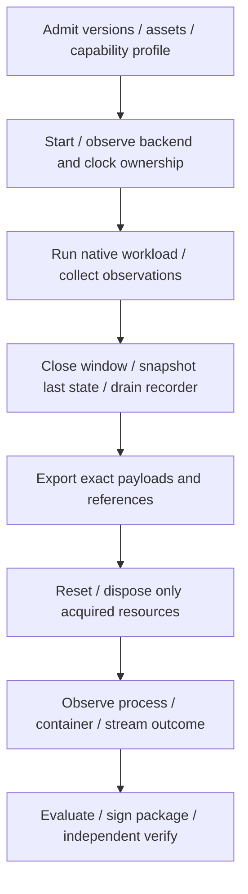
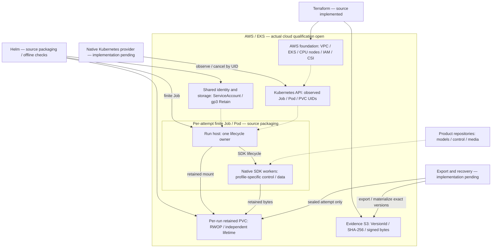

# Architecture

This repository implements execution environments and simulator providers for
[the runtime architecture](https://github.com/mmkolpakov/robotics-runtime/blob/main/docs/architecture.md).
The common Python packages validate documents and evaluate evidence; the Cordis
host manages composition and owned resources. Product repositories supply
application-specific behavior and assets.

## Execution and native APIs

A provider is a Cordis plugin plus its bounded native worker, environment and
qualification profile. Compose/Execa owns worker execution. Engine metadata is
read from the same actual endpoint; missing required facts are not filled from
Compose declarations.

Gazebo, Webots and Isaac remain separate native paths:

- ROS Gazebo uses Jazzy/Harmonic and upstream `simulation_interfaces`.
  ROS-free PX4/Gazebo uses native Gz Transport/WorldControl and MAVSDK.
- Webots uses `webots-controller`, a finite `Robot/Supervisor` controller and
  native camera capture. No common ROS dependency or unverified PX4 bridge is
  introduced.
- Isaac uses its official runtime, native application/physics/rendering APIs
  and RTSP writer. The provider retains GPU/runtime/asset identities and
  separate license requirements.

Control and media clients consume the selected native SDK or endpoint directly.
The host does not carry frame payloads, replace the autopilot or translate scenes.
SDF, WBT/PROTO and USD fixtures are checked separately.

## Readiness and capability scope

A loaded plugin, a healthy process, a discovered service and a completed operation
are different facts. Backend startup must establish its native world/device,
required observations and time ownership. A published `GetSimulatorFeatures`
response does not prove that one request advances one physics tick.

Capabilities are accepted for an exact version and environment. A native camera
buffer is not an RTSP endpoint. General simulator integration is not drone
dynamics or autopilot qualification.

Retained ROS v1 requirements such as Clock/JointState/TF remain in their own
profile. Non-ROS providers use native observations and the generic document/
evaluation boundary; they do not generate a fictitious ROS graph.

## Resource and evidence lifecycle

Export precedes destructive reset or disposal. Plugin disposal does not reverse
commands or erase retained evidence. Cleanup errors and incomplete runtime facts
cannot produce a successful qualification; diagnostics remain available.

Inputs are read-only and distinct from writable results. Host and workers have
observed UID/group mappings. Docker and rootless Podman use deployment settings
appropriate to their actual Engine/socket; they do not require changing host
network or remote-access settings.

## Environments and releases

The common host and portable workers are checked on Docker CI and the declared
rootless Podman profile. Isaac's initial renderer/media profile requires a
supported native NVIDIA environment; CUDA discovery alone is not renderer
qualification. Offscreen frames and their visual review are separate from
physics-only success. A stream does not qualify a desktop GUI.

Own provider/bootstrap code and fixtures can be released independently of a
vendor runtime. NVIDIA runtime/assets are consumed through their official
distribution and are not silently republished in this repository's registry.

Source and released runs are independent gates. An immutable Python pair, host
asset and infra lock retain separate source identities; release qualification
installs the published artifacts without rebuilding them from source.

The provider line is under development. The retained released profile keeps its
current [compatibility scope](compatibility.md); the open neutral-robot
time/readiness failure remains open until a new complete run passes.

## Product deployment ownership

[Component responsibilities](component-responsibilities.md) records the existing
language/tool boundaries and planned Ansible, Terraform and Kubernetes paths.
[ADR 0009](decisions/0009-product-deployment-boundaries.md) keeps product deployment
independent of a particular development machine and of private home infrastructure.
Cloud configuration and execution remain unqualified until their own acceptance
checks pass; application composition does not provide cluster scheduling.

## Kubernetes and AWS responsibilities

The cloud path separates infrastructure, workload packaging, native lifecycle
and retained evidence. This is a responsibility map; it does not describe a
qualified cloud execution. Terraform foundation source is implemented. Helm
packaging has offline lint, render, schema and ownership checks. The native Kubernetes
provider, durable recovery/export and actual EKS acceptance remain
open.

<!-- kubernetes-boundaries:start -->

<!-- kubernetes-boundaries:end -->

This native Mermaid block is the editable source for this responsibility map.
The shared runtime C4 continues to show the current local source topology.

Terraform owns VPC/EKS, bounded On-Demand CPU node capacity, ECR, IAM/Pod
Identity, EBS CSI add-ons and encrypted/versioned S3. State and evidence use
separate buckets; standard S3 backend locking belongs to Terraform state.
The product namespace and ServiceAccount must match the Pod Identity
association. See [AWS foundation](../terraform/README.md).

Helm separates long-lived shared identity/StorageClass, one retained RWOP PVC
per admitted run, and a finite Job per attempt. The retained PVC has no Job
owner reference. Job TTL or attempt cleanup does not reclaim that PVC.
The source Job template places one lifecycle host beside finite native SDK workers;
read-only admitted inputs stay separate from retained results, and only IPC
and scratch are ephemeral. This packaging does not run the existing
Docker/Compose providers inside Kubernetes.

The planned native Kubernetes provider uses the official
`@kubernetes/client-node` API to observe actual
Job/Pod/PVC identities and implement bounded cancellation and cleanup with
UID checks. Labels locate resources; exact owner bindings govern effects.
SDK readiness, simulation time, control and media remain native profile facts.
Product models, control policy and media pipelines stay in their product
repositories and selected SDKs; the common lifecycle does not translate them.
No custom operator, scheduler, workflow engine, distributed state database
or lock service is introduced.

Cloud recovery must retain a durable sealed attempt journal on the PVC and
establish
that the previous writer has stopped before recovery. RWOP, a terminal API
phase and Job parallelism do not provide effect fencing or exactly-once
execution. Lost or ambiguous attempts remain incomplete. Export recovery
starts no measurement workers and never replays physical actions. It verifies
the original S3 VersionId, SHA-256, size and signatures, then materializes
verified bytes in an isolated POSIX root for the existing harness.

Offline Terraform/Helm checks are distinct from real EKS/IAM/CSI credential,
storage, node-loss, drain/export and cleanup acceptance. Storage encryption,
PVC retention and signature verification do not qualify a workload.
Product Ansible handles enrolled product nodes independently; private
home-infra and developer-machine rules are not product dependencies.
